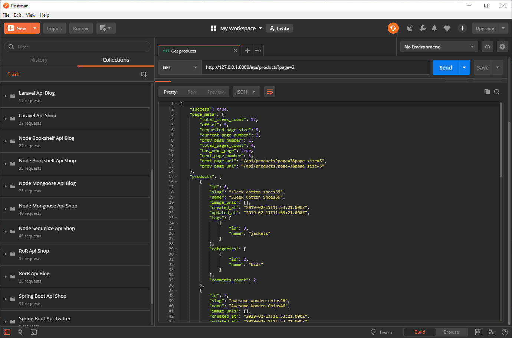
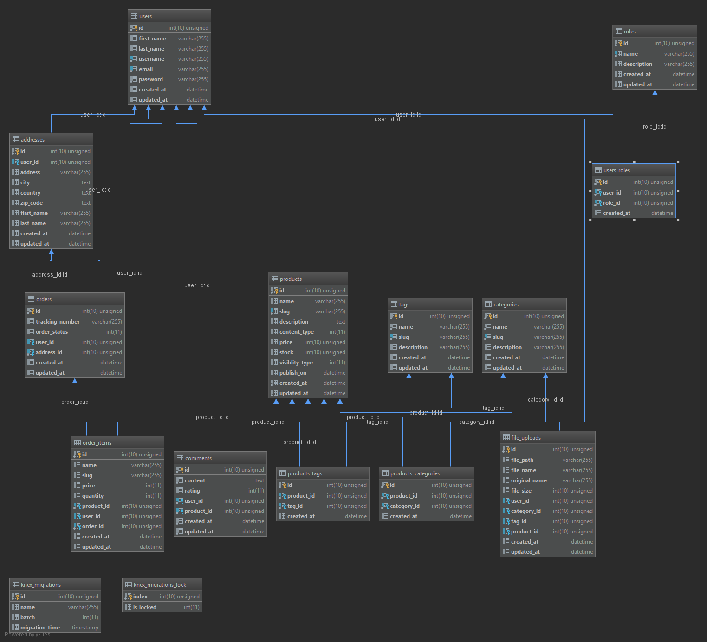

# Introduction
This is one of my E-commerce API app implementations. It is written in Node js, using Express and Bookshelf as the main dependencies.
This is not a finished project by any means, but it has a valid enough shape to be git cloned and studied if you are interested in this topic.
If you are interested in this project take a look at my other server API implementations I have made with:

- Node Js + Sequelize
- Node Js + Mongoose
- Django
- Flask
- [Java Spring Boot + Hibernate]() for the most part this is the implementation of reference.
- Golang go-gonic
- Ruby on Rails
- AspNet Core
- AspNet MVC
- Laravel

# Getting started
As with most node js projects, do the following
1. git clone the project
2. Rename the .env.example to .env and change the settings according to what you need, I recommend using MySQL, with SQLite you may sometimes have errors.
3. npm install
4. npm start

# Features
- Authentication / Authorization
- Paging
- CRUD operations on products, comments, tags, categories

- Orders, guest users may place an order

# What you will learn
- Bookshelf ORM
    - associations: hasMany, belongsTo, belongsToMany
    - scopes
    - virtuals
    - base
    - knex
    - complex queries
- express
    - middlewares
    - authentication
    - authorization
- misc
    - project structure
    - dotenv

# Understanding the project
The project is meant to be educational, to learn something beyond the hello world thing we find in a lot, lot of 
tutorials and blog posts. Since its main goal is educational, I try to make as much use as features of APIs, in other
words, I used different code to do the same thing over and over, there is some repeated code but I tried to be as unique
as possible so you can learn different ways of achieving the same goal.
Project structure:
- models: Mvc, it is our domain data.
- dtos: it contains our serializers, they will create the response to be sent as json. They also take care of validating the input(feature incomplete)
- controllers: well this is the mvC, our business logic.
- routes: they register routes to router middleware
- middleware: some useful middleware, mainly the authentication and authorization middleware.
- config: the database configurer.
- seeder: contains the file that seeds the database, some developers prefer to generate seed skeleton files and seed the database using knex cli.
I did not in this case, in the future I will have in my Github page a project like this one but only using Knex.
- .env the env file from where to populate the process.env node js environment variable
- public: contains the uploaded files.
# Steps followed to create build this project (incomplete)

- Init knex, this will generate some knexfile.js and migrations 
node_modules\.bin\knex.cmd init
- Generate migrations for each table we want to create
node_modules\.bin\knex.cmd migrate:make create_products_categories
- Run migration files to create tables
node_modules\.bin\knex.cmd migrate:latest
- Seed database with:
`node seeder\seeds.js`
or
`npm run seed`
node_modules\.bin\knex.cmd migrate:rollback
node_modules\.bin\knex.cmd seed:make seed_subscriptions
node_modules\.bin\knex.cmd seed:run

# TODO
- The app is lacking validation other than basic authentication.
- Better error handling.
- Implement transactions in createOrder and createTag and createCategories the least.
- Use batch functions in seeds for bulk inserts.
- Review data types of columns, some are only varchar(255) which may not be enough.
- Refractor the code, either use snake case style or camel case Style, not mix.
- Better way of loading models, I have seen many implementations that read any files in the models folder and load them,
it is just a matter of time before I take one of those snippets or write one by my own.

# Resources
- [Bookshelf scopes](https://www.npmjs.com/package/bookshelf-scopes)
- [Bookshelf schema](https://bookshelf-schema.readthedocs.io/en/latest/scopes.html#default-scope)
- [Bookshelf pagination](https://github.com/bookshelf/bookshelf/wiki/Plugin:-Pagination)
- [Bookshelf base](https://www.npmjs.com/package/bookshelf-modelbase)
- [Bookshelf virtuals](https://github.com/bookshelf/bookshelf/wiki/Plugin:-Virtuals)